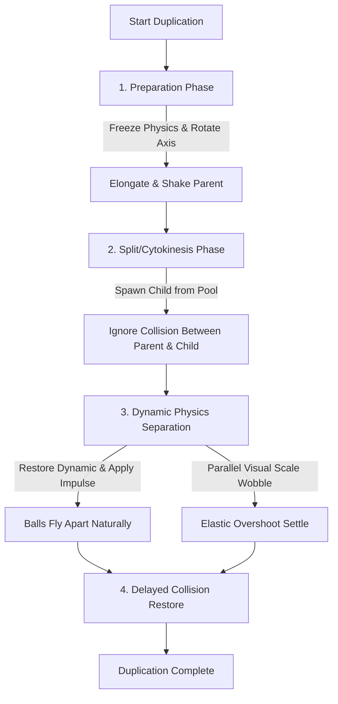

# Mitosis-Style Ball Duplication Architecture

This document details the design and implementation of the high-fidelity mitosis (cell-division) duplication animation for ball entities.

---

## 1. Architectural Concept

The goal of the improved duplication feel is to replicate the organic look and physical presence of biological mitosis. Rather than an instantaneous and simple spawn, the duplication process is broken down into a charging preparation phase and a physics-driven dynamic separation phase.

---

## 2. Animation Phases & Mechanics

### Phase 1: Preparation (Tension & Charging)
* **Goal**: Build visual tension before the cell splits.
* **Mechanics**:
  1. The parent ball's physics execution is paused (`IsProcessing = true`).
  2. The parent `Rigidbody2D` is locked to `Kinematic` and its velocity is set to zero to prevent sliding.
  3. A random division vector `splitDirection` is chosen, and the parent's `transform.rotation` is aligned along this split angle.
  4. The parent ball undergoes a scale tween, stretching along the local X-axis (split axis) up to `_maxStretch` and squashing along the local Y-axis down to `_minSquash`.
  5. Concurrently, a fast, low-amplitude vibration (`transform.DOShakePosition`) is applied to simulate energetic tension under the cell's membrane.

### Phase 2: Cytokinesis (The Split)
* **Goal**: Spawn the daughter cell and separate their physics.
* **Mechanics**:
  1. The child ball is spawned from `BallPoolManager` at the exact current position of the parent.
  2. The child inherits the parent's current scale, rotation, and kinematic state to form a perfectly contiguous double-cell shape at the moment of splitting.
  3. Both parent and child trigger a burst of particles (`_particlesDuplicate`) to provide visual flair at the split point.
  4. **Selective Collision Ignore**: To allow the two halves of the dividing cell to slide through and away from each other without glitching, `Physics2D.IgnoreCollision(parentCollider, childCollider, true)` is called.

### Phase 3: Separation & Natural Drift
* **Goal**: Separate the cells using pure dynamic forces, creating a seamless, realistic drift that integrates with other world collisions.
* **Mechanics**:
  1. Both parent and child are immediately returned to `Dynamic` physics, and their rotations are reset to identity (`Quaternion.identity`).
  2. Their processing state is unlocked (`IsProcessing = false`).
  3. A single, powerful physical parting impulse (`_partingImpulse`) is applied instantly via their physics passports in opposite directions along `splitDirection`.
  4. The balls fly apart naturally under Unity's 2D physics engine, smoothly accelerating, colliding, and transferring kinetic energy to surrounding dynamic elements in the scene.

### Phase 4: Settle & Delayed Restore
* **Goal**: Animate visual scale recovery and restore regular collision states.
* **Mechanics**:
  1. In parallel to the physics separation, both scales are tweened back to normal `(1, 1, 1)` over `_splitDuration` using `Ease.OutElastic`. This creates a beautiful, organic mitosis wobble that resolves as they fly apart.
  2. A delayed callback (`DOVirtual.DelayedCall(_splitDuration, ...)`) is scheduled to re-enable collisions between them: `Physics2D.IgnoreCollision(parentCollider, childCollider, false)`.

---

## 3. Inspector Settings & Odin Grouping

All settings are organized under a dedicated foldout inside `BallEntity.cs` using Sirenix Odin Inspector:

* **Prep Duration** (`_prepDuration`): Time taken to charge/elongate (Default: `0.35s`).
* **Split Duration** (`_splitDuration`): Duration of the visual scale wobble and pairwise ignore collision delay (Default: `0.45s`).
* **Vibration Intensity** (`_vibrationIntensity`): Amplitude of the charge shake (Default: `0.08`).
* **Max Stretch** (`_maxStretch`): Elongation scale along split axis (Default: `1.4`).
* **Min Squash** (`_minSquash`): Squash scale perpendicular to split axis (Default: `0.6`).
* **Parting Impulse** (`_partingImpulse`): Physical force applied to fly the balls apart dynamically (Default: `4.0` units).
* **Scale Ease** (`_scaleEase`): Springy recovery curve (Default: `Ease.OutElastic`).
